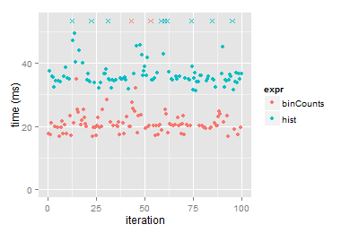
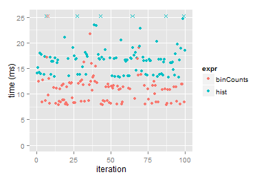
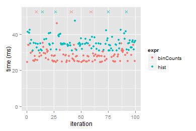

[matrixStats]: Benchmark report

---------------------------------------


# binCounts() benchmarks

This report benchmark the performance of binCounts() against alternative methods.

## Alternative methods

* hist()

as below

```r
> hist <- graphics::hist
> binCounts_hist <- function(x, bx, right = FALSE, ...) {
+     hist(x, breaks = bx, right = right, include.lowest = TRUE, 
+         plot = FALSE)$counts
+ }
```


## Data type "integer"

### Non-sorted simulated data
```r
> set.seed(48879)
> nx <- 1e+05
> xmax <- 0.01 * nx
> x <- runif(nx, min = 0, max = xmax)
> storage.mode(x) <- mode
> str(x)
 int [1:100000] 722 285 591 3 349 509 216 91 150 383 ...
> nb <- 10000
> bx <- seq(from = 0, to = xmax, length.out = nb + 1)
> bx <- c(-1, bx, xmax + 1)
```

### Results


```r
> gc()
         used (Mb) gc trigger (Mb) max used (Mb)
Ncells 564430 30.2     940480 50.3   750400 40.1
Vcells 841856  6.5    1667849 12.8  1228006  9.4
> stats <- microbenchmark(binCounts = binCounts(x, bx = bx), 
+     hist = binCounts_hist(x, bx = bx), unit = "ms")
```

_Table: Benchmarking of binCounts() and hist() on integer+unsorted data. The top panel shows times in milliseconds and the bottom panel shows relative times._


|expr      |      min|       lq|     mean|   median|       uq|      max|
|:---------|--------:|--------:|--------:|--------:|--------:|--------:|
|binCounts | 16.59222| 19.50034| 22.71832| 20.16554| 22.68929| 115.8014|
|hist      | 31.35514| 34.61049| 43.89354| 35.42313| 37.56750| 157.2361|


|expr      |     min|       lq|     mean|   median|       uq|      max|
|:---------|-------:|--------:|--------:|--------:|--------:|--------:|
|binCounts | 1.00000| 1.000000| 1.000000| 1.000000| 1.000000| 1.000000|
|hist      | 1.88975| 1.774866| 1.932077| 1.756617| 1.655738| 1.357809|
_Figure: Benchmarking of binCounts() and hist() on integer+unsorted data.  Outliers are displayed as crosses.  Times are in milliseconds._



### Sorted simulated data
```r
> x <- sort(x)
```
```r
> gc()
         used (Mb) gc trigger (Mb) max used (Mb)
Ncells 638467 34.1    1168576 62.5   940480 50.3
Vcells 921411  7.1    2081418 15.9  1699509 13.0
> stats <- microbenchmark(binCounts = binCounts(x, bx = bx), 
+     hist = binCounts_hist(x, bx = bx), unit = "ms")
```

_Table: Benchmarking of binCounts() and hist() on integer+sorted data. The top panel shows times in milliseconds and the bottom panel shows relative times._


|expr      |       min|        lq|     mean|   median|       uq|      max|
|:---------|---------:|---------:|--------:|--------:|--------:|--------:|
|binCounts |  7.849565|  8.460869| 12.09374| 10.98462| 11.99646| 143.8224|
|hist      | 13.267385| 14.015154| 20.94032| 16.72637| 17.70107| 122.9788|


|expr      |      min|       lq|     mean|   median|       uq|       max|
|:---------|--------:|--------:|--------:|--------:|--------:|---------:|
|binCounts | 1.000000| 1.000000| 1.000000| 1.000000| 1.000000| 1.0000000|
|hist      | 1.690206| 1.656467| 1.731501| 1.522709| 1.475524| 0.8550739|
_Figure: Benchmarking of binCounts() and hist() on integer+sorted data.  Outliers are displayed as crosses.  Times are in milliseconds._



## Data type "double"

### Non-sorted simulated data
```r
> set.seed(48879)
> nx <- 1e+05
> xmax <- 0.01 * nx
> x <- runif(nx, min = 0, max = xmax)
> storage.mode(x) <- mode
> str(x)
 num [1:100000] 722.11 285.54 591.33 3.42 349.14 ...
> nb <- 10000
> bx <- seq(from = 0, to = xmax, length.out = nb + 1)
> bx <- c(-1, bx, xmax + 1)
```

### Results


```r
> gc()
         used (Mb) gc trigger (Mb) max used (Mb)
Ncells 638488 34.1    1168576 62.5  1168576 62.5
Vcells 971434  7.5    2081418 15.9  2078871 15.9
> stats <- microbenchmark(binCounts = binCounts(x, bx = bx), 
+     hist = binCounts_hist(x, bx = bx), unit = "ms")
```

_Table: Benchmarking of binCounts() and hist() on double+unsorted data. The top panel shows times in milliseconds and the bottom panel shows relative times._


|expr      |      min|       lq|     mean|   median|       uq|      max|
|:---------|--------:|--------:|--------:|--------:|--------:|--------:|
|binCounts | 24.51184| 25.34546| 31.65623| 27.96968| 29.79474| 157.2319|
|hist      | 30.98790| 33.11149| 38.81089| 34.90248| 37.53651| 146.6468|


|expr      |      min|       lq|     mean|   median|       uq|       max|
|:---------|--------:|--------:|--------:|--------:|--------:|---------:|
|binCounts | 1.000000| 1.000000| 1.000000| 1.000000| 1.000000| 1.0000000|
|hist      | 1.264201| 1.306407| 1.226011| 1.247868| 1.259837| 0.9326788|
_Figure: Benchmarking of binCounts() and hist() on double+unsorted data.  Outliers are displayed as crosses.  Times are in milliseconds._



### Sorted simulated data
```r
> x <- sort(x)
```
```r
> gc()
         used (Mb) gc trigger (Mb) max used (Mb)
Ncells 638503 34.1    1168576 62.5  1168576 62.5
Vcells 971956  7.5    2081418 15.9  2078871 15.9
> stats <- microbenchmark(binCounts = binCounts(x, bx = bx), 
+     hist = binCounts_hist(x, bx = bx), unit = "ms")
```

_Table: Benchmarking of binCounts() and hist() on double+sorted data. The top panel shows times in milliseconds and the bottom panel shows relative times._


|expr      |       min|       lq|     mean|   median|       uq|      max|
|:---------|---------:|--------:|--------:|--------:|--------:|--------:|
|binCounts |  9.040992|  9.78934| 16.65968| 12.49998| 13.17865| 147.0938|
|hist      | 14.157009| 15.29012| 18.97876| 17.78057| 18.53777| 126.3437|


|expr      |      min|       lq|     mean|   median|       uq|       max|
|:---------|--------:|--------:|--------:|--------:|--------:|---------:|
|binCounts | 1.000000| 1.000000| 1.000000| 1.000000| 1.000000| 1.0000000|
|hist      | 1.565869| 1.561915| 1.139203| 1.422447| 1.406651| 0.8589329|
_Figure: Benchmarking of binCounts() and hist() on double+sorted data.  Outliers are displayed as crosses.  Times are in milliseconds._


## Appendix

### Session information
```r
R Under development (unstable) (2015-09-16 r69392)
Platform: x86_64-w64-mingw32/x64 (64-bit)
Running under: Windows 7 x64 (build 7601) Service Pack 1

locale:
[1] LC_COLLATE=English_United States.1252 
[2] LC_CTYPE=English_United States.1252   
[3] LC_MONETARY=English_United States.1252
[4] LC_NUMERIC=C                          
[5] LC_TIME=English_United States.1252    

attached base packages:
[1] stats     graphics  grDevices utils     datasets  methods   base     

other attached packages:
[1] microbenchmark_1.4-2   ggplot2_1.0.1          knitr_1.11            
[4] R.devices_2.13.0-9000  R.utils_2.1.0-9000     R.oo_1.19.0           
[7] R.methodsS3_1.7.0-9000 R.rsp_0.20.0-9000      matrixStats_0.14.2    

loaded via a namespace (and not attached):
 [1] rex_1.0.1        Rcpp_0.12.1      magrittr_1.5     covr_1.2.3      
 [5] MASS_7.3-44      munsell_0.4.2    colorspace_1.2-6 R.cache_0.11.0  
 [9] highr_0.5.1      stringr_1.0.0    plyr_1.8.3       tools_3.3.0     
[13] grid_3.3.0       gtable_0.1.2     lazyeval_0.1.10  digest_0.6.8    
[17] reshape2_1.4.1   base64enc_0.1-3  labeling_0.3     stringi_0.5-5   
[21] scales_0.3.0     Cairo_1.5-8      proto_0.3-10    
```
Total processing time was 24.67 secs.


### Reproducibility
To reproduce this report, do:
```r
html <- matrixStats:::benchmark('binCounts')
```

[RSP]: http://cran.r-project.org/package=R.rsp
[matrixStats]: http://cran.r-project.org/package=matrixStats

[StackOverflow:colMins?]: http://stackoverflow.com/questions/13676878 "Stack Overflow: fastest way to get Min from every column in a matrix?"
[StackOverflow:colSds?]: http://stackoverflow.com/questions/17549762 "Stack Overflow: Is there such 'colsd' in R?"
[StackOverflow:rowProds?]: http://stackoverflow.com/questions/20198801/ "Stack Overflow: Row product of matrix and column sum of matrix"

---------------------------------------
Copyright Henrik Bengtsson. Last updated on 2015-09-20 14:45:17 (-0700 UTC). Powered by [RSP].

<script>
 var link = document.createElement('link');
 link.rel = 'icon';
 link.href = "data:image/png;base64,iVBORw0KGgoAAAANSUhEUgAAACAAAAAgCAMAAABEpIrGAAAADFBMVEX9/v0AAP/9/v3//wBEQjoBAAAABHRSTlP//wD//gy7CwAAAGJJREFUOI3N0rESwCAIA9Ag///PXdoiBk0HhmbNO49DMETQCexNCSyFgdlGoO5DYOr9ThLgPosA7osIQP0sHuDOog8UI/ALa988wzdwXJRctf4s+d36YPTJ6aMd8ux3+QO4ABTtB85yDAh9AAAAAElFTkSuQmCC"
 document.getElementsByTagName('head')[0].appendChild(link);
</script>


